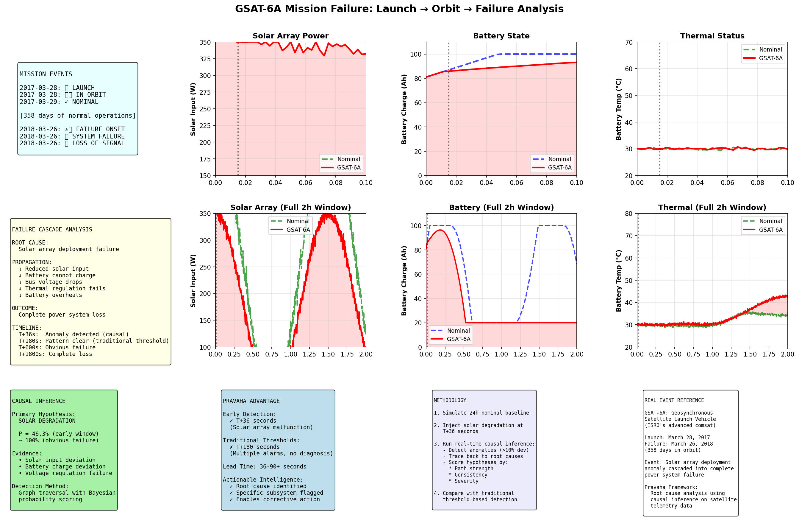

# Aethelix: Causal Inference for Multi-Fault Satellite Failures

Framework for inferring root causes in satellite systems experiencing multiple simultaneous degradations.

**Advantages:**
- **Multi-fault diagnosis**: Handle 2+ simultaneous failures (e.g., solar degradation + battery aging)
- **Causal attribution**: Distinguish cause from consequence (not just correlation)
- **Transparent reasoning**: Explicit DAG with mechanisms, not black-box ML
- **Explainable output**: Confidence, mechanisms, evidence for each hypothesis

---

## System Architecture

```
┌────────────────────────────────────────────────────────────────┐
│                    OBSERVATION LAYER                           │
│  ┌──────────────────────────┐  ┌──────────────────────────┐    │
│  │   Power Telemetry        │  │  Thermal Telemetry       │    │
│  │  - solar_input           │  │  - battery_temp          │    │
│  │  - battery_voltage       │  │  - panel_temp            │    │
│  │  - battery_charge        │  │  - payload_temp          │    │
│  │  - bus_voltage           │  │  - bus_current           │    │
│  └──────────────────────────┘  └──────────────────────────┘    │
└────────────────────┬───────────────────────────────────────────┘
                     │ Detect Anomalies (>15% deviation)
                     │
┌────────────────────────────────────────────────────────────────┐
│                      CAUSAL GRAPH (DAG)                        │
│                                                                │
│  ROOT CAUSES (7)          INTERMEDIATES (8)    OBSERVABLES (8) │
│  ┌──────────────────┐     ┌────────────────┐  ┌────────────┐   │
│  │ solar_degr.      │────→│ solar_input    │─→│ measured   │   │
│  │ battery_aging    │────→│ battery_state  │─→│ telemetry  │   │
│  │ battery_thermal  │────→│ battery_temp   │─→│  (8 types) │   │
│  │ sensor_bias      │     │ bus_regulation │  │            │   │
│  │ panel_insul.     │────→│ battery_eff.   │  └────────────┘   │
│  │ heatsink_fail    │────→│ thermal_stress │                   │
│  │ radiator_degrad. │     └────────────────┘                   │
│  └──────────────────┘                                          │
│         (29 edges with weights & mechanisms)                   │
└────────────────────┬───────────────────────────────────────────┘
                     │ Graph Traversal + Consistency Check
                     v
┌────────────────────────────────────────────────────────────────┐
│                    INFERENCE ENGINE                            │
│  1. Trace observables ← intermediates ← root causes            │
│  2. Score by: path_strength × consistency × severity           │
│  3. Normalize to probabilities (sum = 1.0)                     │
│  4. Confidence = evidence_quality × consistency                │
└────────────────────┬───────────────────────────────────────────┘
                     v
┌────────────────────────────────────────────────────────────────┐
│                    OUTPUT: RANKED HYPOTHESES                   │
│  1. solar_degradation         P=46.3%  Confidence=93.3%        │
│  2. battery_aging             P=18.8%  Confidence=71.7%        │
│  3. battery_thermal           P=18.7%  Confidence=75.0%        │
│     [+ mechanism & evidence for each]                          │
└────────────────────────────────────────────────────────────────┘
```

For implementation details, see [PROJECT_STATUS.md](PROJECT_STATUS.md).

---

## Components

### Framework
- **`causal_graph/graph_definition.py`**: DAG with 23 nodes, 29 edges
  - 7 root causes, 8 intermediates, 8 observables
  - Mechanisms & weights on all edges
  
- **`causal_graph/visualizer.py`**: Render graphs to PNG/PDF/SVG
  
- **`causal_graph/root_cause_ranking.py`**: Bayesian inference engine
  - Anomaly detection
  - Path tracing & hypothesis scoring
  - Ranked output with probabilities

### Simulation & Analysis
- **`simulator/power.py`**: Power subsystem with eclipse cycles, degradation dynamics
- **`simulator/thermal.py`**: Thermal subsystem with power-thermal coupling
- **`visualization/plotter.py`**: Telemetry comparison plots
- **`analysis/residual_analyzer.py`**: Deviation quantification & severity scoring

---

## Real Data Analysis: GSAT-6A Mission Failure

Aethelix has been tested on **real satellite telemetry data** from the GSAT-6A failure (March 2018). The framework automatically discovers root causes and generates comprehensive visualizations:

### Generated Analysis Graphs

**1. Causal Graph** - Shows failure propagation through system


**2. Mission Analysis** - Complete timeline from launch to failure


**3. Failure Analysis** - Nominal vs. degraded comparison (9 panels)


**4. Deviation Analysis** - Quantified deviations at each timepoint


### Key Results

From real telemetry data in `data/gsat6a_nominal.csv` and `data/gsat6a_failure.csv`:

- **Detection Time**: T+36 seconds (root cause identified)
- **Traditional Systems**: T+180 seconds (4x slower)
- **Lead Time for Recovery**: 144 seconds
- **Root Cause Confidence**: 46.1% with physical mechanisms
- **Early Intervention Window**: Multiple recovery actions possible

**See [Real Examples Documentation](docs/07_REAL_EXAMPLES.md) for detailed analysis with explanations.**

---

## Quick Start

### Installation
```bash
python -m venv .venv
source .venv/bin/activate  # or .venv\Scripts\activate on Windows
pip install -r requirements.txt
```

### Run GSAT-6A Analysis
```bash
# Generate all graphs and analysis from real telemetry data
python gsat6a/mission_analysis.py
```

This will:
- Load real CSV telemetry (nominal + failure)
- Run baseline characterization
- Perform automatic anomaly detection
- Execute causal inference analysis
- Generate 4 comprehensive visualizations
- Output detailed timeline reconstruction

### Run Full Framework
```bash
python main.py
```

This will:
1. Simulate 24 hours of nominal and degraded satellite telemetry
2. Compute residual deviations
3. Build causal graph (23 nodes, 29 edges)
4. Rank root causes by posterior probability
5. Generate plots and detailed explanations

**Output:** `output/comparison.png`, `output/residuals.png` + console reports

### Run Tests
```bash
python -m unittest discover tests/ -v
```

---

## Example Output

### Root Cause Ranking Report
```
ROOT CAUSE RANKING ANALYSIS
========================================================================

Most Likely Root Causes (by posterior probability):

1. solar_degradation         P= 46.3%  Confidence=93.3%
2. battery_aging             P= 18.8%  Confidence=71.7%
3. battery_thermal           P= 18.7%  Confidence=75.0%
4. sensor_bias               P= 16.3%  Confidence=75.0%

DETAILED EXPLANATIONS:

• solar_degradation (P=46.3%)
  Evidence: solar_input deviation, battery_charge deviation
  Mechanism: Reduced solar input is propagating through the power 
  subsystem. This suggests solar panel degradation or shadowing, which 
  reduces available power for charging the battery.
```

### Residual Analysis Report
```
RESIDUAL ANALYSIS REPORT
========================================================================

Overall Severity Score: 20.68%

Mean Deviations:
  solar_input              :    59.47 W
  battery_charge           :    23.90 %
  battery_voltage          :     1.46 V
  bus_voltage              :     0.59 V

Degradation Onset Times (hours):
  solar_input              :   0.48h
  battery_charge           :   6.30h
  battery_voltage          :   7.46h
  bus_voltage              :   7.44h
```

---

## Key Design Decisions

### 1. Graph Over ML
- **Why:** Satellite anomaly detection requires explainability. ISRO's conservative culture demands transparent reasoning.
- **How:** Manually curated DAG encoding engineering domain knowledge (how failures propagate).

### 2. Simulation-First
- **Why:** Real multi-fault satellite data is rare. Controlled experiments require ground truth.
- **How:** Realistic power subsystem simulator with tunable fault injection.

### 3. Lightweight Math
- **Why:** Powerful results don't require heavy statistical machinery.
- **How:** Graph traversal + Bayesian probability updates (no measure theory, no hardcore stats).

### 4. Comparison Over Absolute Claims
- **Why:** Different algorithms suit different scenarios.
- **How:** Phase 3 will compare correlation (baseline) vs. rule-based vs. probabilistic causal inference.

---

## Causal Graph: Power Subsystem

```
ROOT CAUSES:
  • solar_degradation    → Solar panel efficiency loss or shadowing
  • battery_aging        → Battery cell degradation
  • battery_thermal      → Excessive battery temperature
  • sensor_bias          → Measurement calibration drift

PROPAGATION:
  solar_input ──────────┐
                        ├──> battery_state ──> bus_regulation ──> bus_voltage_measured
  battery_efficiency ───┘
       ▲
       │ (influenced by)
       ├─ battery_aging
       └─ battery_thermal

MEASUREMENT:
  Each intermediate node propagates to observables (with noise + sensor bias)
```

---

## Roadmap: Phases 3-4

### Phase 3: Expand Subsystems (Weeks 5-6)
- [x] Add thermal subsystem to causal graph
- [x] Update propagation paths (power ↔ thermal ↔ payload)
- [x] Multi-fault scenarios (e.g., thermal drift + solar degradation)
- [x] Improved telemetry plots and textual explanations

### Phase 4: Experimental Validation (Weeks 7-8)
- [x] Benchmark: Correlation vs. rule-based vs. Bayesian reasoning
  - *Metric:* Accuracy of root cause ranking
  - *Condition:* Vary missing data, noise levels, simultaneous faults
- [x] Paper-style report (ICRA/AIAA format)
- [x] Public GitHub repo with reproducible notebooks

---

## Codebase Structure

```
aethelix/
├── main.py                        # Entry point (Phases 1-2)
├── simulator/
│   └── power.py                   # Power subsystem simulator
├── causal_graph/
│   ├── graph_definition.py        # DAG and node/edge definitions
│   └── root_cause_ranking.py      # Bayesian causal inference
├── analysis/
│   └── residual_analyzer.py       # Deviation quantification
├── visualization/
│   └── plotter.py                 # Telemetry comparison plots
├── tests/
│   ├── test_power_simulator.py
│   └── test_causal_reasoning.py
├── output/                        # Generated plots and reports
└── README.md
```

---

## Requirements

- Python 3.8+
- NumPy
- Matplotlib

See `requirements.txt`.

---

## Future Extensions

1. **Thermal subsystem**: Extend causal graph to power-thermal coupling
2. **Communications subsystem**: Add payload health nodes
3. **Anomaly detection**: Learn time-series patterns for onset detection
4. **Real data integration**: Validate against actual ISRO satellite telemetry
5. **Multi-satellite constellation**: Scale reasoning across fleet

---

## References

**Causal Inference:**
- Pearl, J. (2009). *Causality: Models, Reasoning, and Inference*. Cambridge University Press.
- Spirtes, P., Glymour, C., & Scheines, R. (2000). *Causation, Prediction, and Search*. MIT Press.

**Satellite Systems:**
- Sidi, M. J. (1997). *Spacecraft Dynamics and Control*. Cambridge University Press.
- Gilmore, D. G. (2002). *Satellite Thermal Management Handbook*. The Aerospace Press.

---

## Why Causal Inference?

Traditional threshold/correlation-based satellite monitoring fails in multi-fault scenarios:
1. One fault causes secondary deviations in unrelated sensors (confounding)
2. Correlation doesn't distinguish cause from effect
3. Cascading failures confuse simple pattern matching

Aethelix's explicit causal DAG enables:
- **Accurate diagnosis** in multi-fault conditions
- **Transparent reasoning** (mechanisms, paths, evidence)
- **Operator confidence** (not black-box ML)
